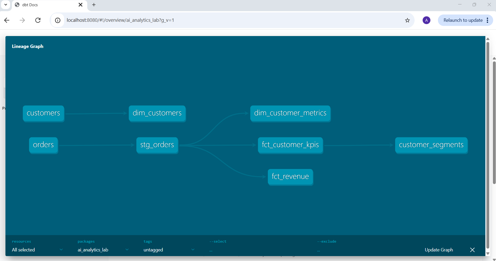
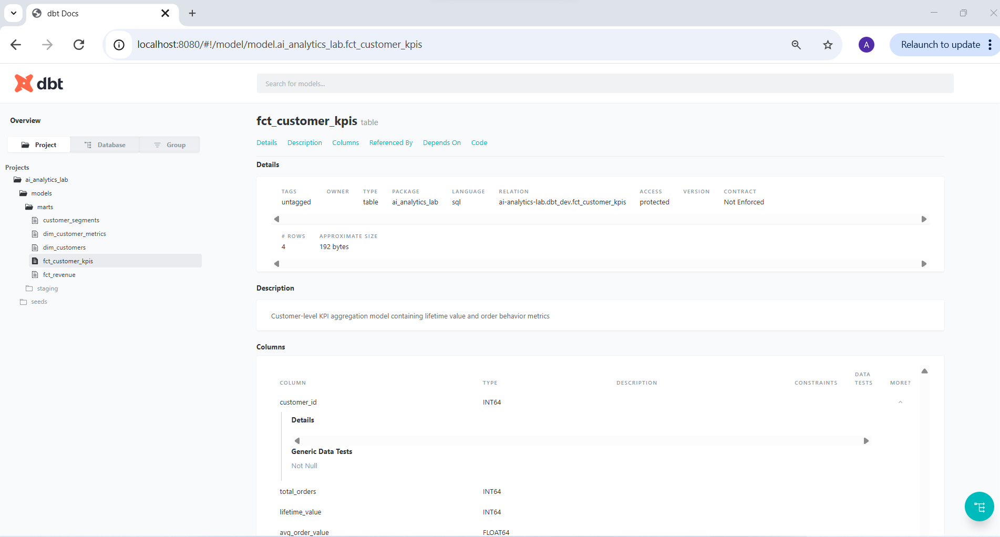

# AI Analytics Lab

Cloud-native Analytics Engineering and AI-Ready Analytics Platform built using dbt and BigQuery.

---

## 🎯 Business Problem

Organizations often struggle with:

- Inconsistent KPI definitions
- Siloed reporting logic
- Limited governance and lineage visibility
- Lack of semantic business definitions
- Challenges adopting AI-assisted analytics

This project demonstrates how modern analytics engineering practices can create a governed, semantic, and AI-ready analytics platform.

---

## ⚙️ Technology Stack

### Data Platform
- Google BigQuery

### Analytics Engineering
- dbt Core
- SQL
- YAML

### Version Control
- Git
- GitHub

### Documentation
- dbt Docs
- Markdown

### Analytics Concepts
- Dimensional Modeling
- Semantic Analytics
- Data Products
- Data Contracts
- AI-Ready Metadata

---

## 📂 Repository Structure

```
ai_analytics_lab/
│
├── assets/
│
├── docs/
│   ├── semantic_layer/
│   ├── enterprise_architecture.md
│   ├── operations_architecture.md
│   ├── data_contracts.md
│   └── data_products.md
│
├── governance/
│   └── metric_ownership.md
│
├── operations/
│   ├── pipeline_schedule.md
│   ├── orchestration_design.md
│   └── runbook.md
│
├── models/
│   ├── staging/
│   ├── marts/
│   └── sources.yml
│
├── seeds/
│
├── README.md
└── dbt_project.yml
```
---

## 🏗️ Enterprise Analytics Platform Architecture

```text
Source Systems
      ↓
BigQuery Warehouse
      ↓
dbt Analytics Engineering
      ↓
Facts & Dimensions
      ↓
Semantic Layer
      ↓
Governance Layer
      ↓
Operations Layer
      ↓
Observability Layer
      ↓
AI Analytics Layer (Future)
      ↓
Business Users
```

### Platform Layers

| Layer | Purpose |
|---------|---------|
| Data Platform | Centralized storage and processing |
| Analytics Engineering | Transform raw data into business-ready models |
| Semantic Layer | Business definitions and metric standardization |
| Governance | Ownership, contracts, stewardship |
| Operations | Scheduling, orchestration, runbooks |
| Observability | Freshness, quality, SLA monitoring |
| AI Analytics | Natural language analytics and insight generation |

---

## 🤖 Natural Language Analytics Architecture

```
Business User
      ↓
Natural Language Question
      ↓
Semantic Analytics Layer
      ↓
Metric Definitions + Business Rules
      ↓
SQL Mapping
      ↓
BigQuery Models
      ↓
Business Insight
```
---

## 🏗️ Analytics Engineering Architecture

```
CSV Seeds
      ↓
dbt seed
      ↓
BigQuery Raw Layer
(customers, orders)
      ↓
dbt run
      ↓
Staging Layer
(stg_orders)
      ↓
dbt run
      ↓
Fact Layer
(fct_revenue)
(fct_customer_kpis)
      ↓
dbt run
      ↓
Dimension Layer
(dim_customers)
(dim_customer_metrics)
      ↓
dbt run
      ↓
Semantic Layer
(customer_segments)
      ↓
Business Questions
Metric Definitions
Metric-to-SQL Mapping
      ↓
AI Query Layer
(Future)
```
---

## 🤖 AI-Augmented Analytics Engineering Features

This project incorporates AI-ready analytics engineering concepts:

- Semantic business metric definitions
- YAML-based metadata documentation
- Automated lineage generation
- Standardized KPI modeling
- Analytics-ready dimensional architecture
- Business-context-aware semantic models

The project is structured to support future AI-assisted querying and semantic analytics workflows.

---

## 🏢 Enterprise Analytics Features

Beyond analytics engineering, this project incorporates enterprise data management concepts that support scalable and trustworthy analytics platforms.

### Governance

- Metric ownership
- Business definitions
- Data contracts
- Source documentation

### Analytics Products

- Customer KPI Product
- Revenue Analytics Product
- Customer Segmentation Product

### AI Readiness

- Semantic metric definitions
- Business question catalog
- Metric-to-SQL mappings
- AI-ready metadata architecture
- Lineage documentation

### Platform Capabilities

- dbt transformations
- BigQuery warehouse
- Data quality testing
- Documentation generation
- Semantic analytics layer

---

## ⚙️ Production Operations

The platform incorporates operational analytics engineering concepts that support reliable and scalable execution of analytics workloads.

### Orchestration

* Pipeline scheduling design
* Workflow dependency management
* Automated execution concepts
* SLA-driven processing

### Operational Support

* Analytics platform runbooks
* Failure recovery procedures
* Operational documentation
* Escalation processes

### Production Readiness

* Scheduled pipeline execution
* Automated testing workflows
* Documentation generation workflows
* Monitoring and observability foundations

Operational assets:

* `operations/pipeline_schedule.md`
* `operations/orchestration_design.md`
* `operations/runbook.md`
* `docs/operations_architecture.md`

---

## 📊 Observability & Monitoring

The platform includes foundational observability concepts designed to improve trust, reliability, and operational visibility.

### Monitoring Capabilities

* Data freshness monitoring
* Data quality validation
* KPI reconciliation checks
* SLA tracking
* Anomaly detection concepts

### Observability Assets

* `observability/data_freshness.md`
* `observability/data_quality_monitoring.md`
* `observability/anomaly_detection.md`
* `observability/sla_definitions.md`

### Monitoring Objectives

- Ensure timely data delivery
- Validate business-critical KPIs
- Detect unusual patterns and anomalies
- Improve trust in analytics outputs
- Establish operational accountability

---

## 📊 Data Model

### 1. Raw Layer

**`orders`**

* Source: CSV seed file
* Contains transactional order data

Columns:

* order_id
* customer_id
* order_date
* amount


### 2. Staging Layer

**`stg_orders`**

* Cleaned and standardized version of raw data
* Acts as the base for downstream models


### 3. Metrics Layer (Fact Table)

**`fct_revenue`**

* Grain: one row per `order_date`
* Aggregated business metrics

Metrics:

* total_revenue → sum(amount)
* total_orders → count(order_id)
* unique_customers → count(distinct customer_id)


### 4. Dimension Layer (Derived)

**`dim_customer_metrics`**

* Grain: one row per `customer_id`
* Derived from transactional data (not master data)
* Represents customer behavior, not attributes

Metrics:

* total_orders → count(order_id)
* total_spent → sum(amount)
* first_order_date → min(order_date)
* last_order_date → max(order_date)


### 5. Master Dimension Layer

**`dim_customers`**

* Grain: one row per `customer_id`
* Master customer reference data

Columns:

* customer_id
* customer_name
* city
* country


### 6. Semantic Analytics Layer

**`customer_segments`**

* Grain: one row per `customer_id`
* Customer categorization model based on spending behavior

Logic:

* High Value → lifetime_value >= 500
* Medium Value → lifetime_value >= 200
* Low Value → lifetime_value < 200


### 7. Semantic Documentation Layer

**`docs/semantic_layer/`**

* Contains business-readable analytics definitions
* Maps business questions to trusted dbt models
* Supports future natural-language-to-SQL workflows

Files:

* `business_questions.md` → catalog of business questions
* `metric_definitions.md` → governed metric definitions
* `metric_to_sql_mapping.md` → examples of business questions mapped to SQL

---

## 📚 Enterprise Documentation

### Data Contracts

```
docs/data_contracts.md
```

Defines:

- schema expectations
- ownership
- SLAs
- business criticality

---

### Data Products

```
docs/data_products.md
```

Defines:

- Customer KPI Product
- Revenue Analytics Product
- Customer Segmentation Product

---

### Governance

```
governance/metric_ownership.md
```

Defines:

- metric ownership
- accountability
- stewardship

---

### Operations Documentation

#### Pipeline Schedule

```
operations/pipeline_schedule.md
```

Defines:

* execution schedule
* processing frequency
* SLA expectations
* operational timing

---

#### Orchestration Design

```
operations/orchestration_design.md
```

Defines:

* orchestration patterns
* scheduling architecture
* workflow dependencies
* future orchestration platforms

---

#### Analytics Runbook

```
operations/runbook.md
```

Defines:

* failure recovery procedures
* troubleshooting guidance
* escalation paths
* operational support activities

---

#### Operations Architecture

```
docs/operations_architecture.md
```

Defines:

* pipeline execution flow
* orchestration architecture
* operational objectives
* future production deployment concepts

---
## 🧪 Data Quality & Testing

Implemented using dbt YAML configuration:

* **not_null test** on `order_date` and `customer_id`
* Ensures critical fields are populated
* Validated using:

  ```
  dbt test
  ```
---

## 📚 Generated Analytics Documentation

The project uses dbt Docs to generate:
- interactive lineage DAGs
- metadata catalogs
- model documentation
- dependency visualization
- semantic analytics documentation

Generated artifacts:
- manifest.json
- catalog.json
- compiled SQL metadata

---

## 📊 dbt Lineage Graph



---

## 🧠 Model Documentation



---

## 🧠 Semantic Analytics Layer

This project includes a semantic analytics layer that bridges business language and warehouse queries.

The semantic layer includes:

* Business question catalog
* KPI and metric definitions
* Metric-to-SQL mappings
* AI-ready business context

This layer demonstrates how analytics systems can translate business questions into governed SQL queries using curated dbt models.

---
## 🔄 How to Run This Project

### 1. Install dependencies

```
pip install dbt-core dbt-bigquery
```

### 2. Configure dbt profile

Set up `profiles.yml` with BigQuery credentials

### 3. Load data

```
dbt seed
```

### 4. Run models

```
dbt run
```

### 5. Run tests

```
dbt test
```

---

## 📈 Current State (Day 12)

* Cloud-native analytics engineering platform established
* Raw, staging, fact, dimension, semantic, governance, and operations layers implemented
* KPI engineering and customer segmentation models created
* dbt testing and metadata documentation implemented
* Lineage DAG and model documentation generated
* Business question catalog and metric definitions documented
* Data contracts and analytics products introduced
* Metric ownership and governance concepts implemented
* Operational scheduling and orchestration design documented
* Analytics runbook and support procedures established
* Data freshness monitoring framework defined
* Data quality monitoring framework established
* SLA management concepts implemented
* Anomaly detection framework documented
* Enterprise analytics platform architecture documented
* AI-ready semantic analytics foundation established

---

## 🧠 Key Learnings

* Built an end-to-end analytics engineering workflow using dbt and BigQuery
* Implemented dimensional modeling and KPI engineering concepts
* Developed semantic analytics and business abstraction layers
* Learned how metadata and lineage support AI-assisted analytics
* Introduced governance concepts including data contracts and metric ownership
* Implemented analytics product thinking
* Understood orchestration and scheduling concepts used in modern data platforms
* Learned the role of runbooks and operational support procedures
* Introduced observability concepts including freshness, quality, SLA, and anomaly monitoring
* Strengthened understanding of production analytics platform operations
* Built foundations for future observability, monitoring, and AI-assisted analytics

---

## 🔮 Future Roadmap

### Enterprise Analytics

* Production orchestration
* Automated observability
* Advanced monitoring
* Data contracts automation
* SLA management

### AI-Augmented Analytics

* Natural language to SQL
* AI-generated business insights
* Conversational analytics
* Semantic search across metrics

### Autonomous Analytics

* KPI monitoring agents
* Automated anomaly detection
* Executive insight generation
* Recommendation engines

### Platform Evolution

* CI/CD integration
* Enterprise deployment architecture
* AI governance controls
* Analytics product lifecycle management
* Agentic analytics workflows

---

## 📌 Notes

This project is part of a structured upskilling plan focused on:

* Analytics Engineering
* AI-augmented Data Analytics
* Cloud-based Data Pipelines
